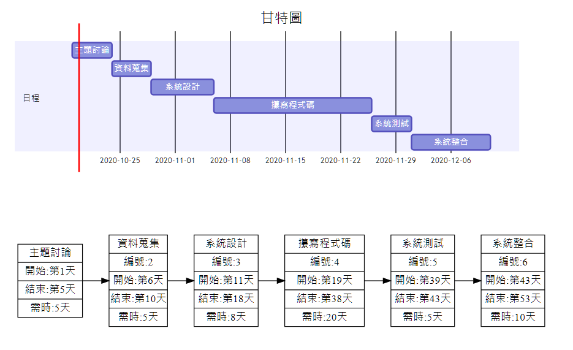

# Project_FirstGroup
### 系統分析專題 
### 組長：林莉庭　組員：陳冠穎、巫易駿、許育碩

### 題目:愛情限時批（劈）

### 創意發想:
雖然市面上已有許多交友軟體，但因為沒有條件的限制，因此容易產生配對，這個現象雖然讓人們更容易地交到朋友，但也在無意間影響了大眾的愛情價值觀。像這樣一對多的聊天型態，從中挑選自己喜愛的，而那些沒被選到的則被放著不理或是塑膠回覆的模式，改變了人與人之間認識的真正意義，進而造成現今速食愛情風氣越來越盛行（因為都是草率的認識、草率的交往、草率的分手:unamused:）。為了改善人們交友的壞習慣以及更精準的配對到喜愛的對象，本團隊預計開發『愛情限時批』強大APP，造福大眾！！:heart::heart::heart:

### 專題內容:
開發一款新穎的交友軟體，改善人與人之間的互動形式與價值觀。 
提供一良好的專屬管道讓不擅長交友的人拓展人際關係 ; 讓單身狗更快找到等待已久的那...個...人！！！:heart::heart::heart:

### 工作分配:
 :vibration_mode:後端開發，勞工擔當『陳冠穎、巫易駿』:vibration_mode: 
 :file_folder:創意發想、報告、送茶按摩，耍酷擔當『許育碩』:file_folder: 
 :crystal_ball:書面及PPT報告製作、前端設計，顏值擔當『林莉庭』:crystal_ball: 

### 需求分析的文字描述
1. 用戶可以藉此軟體找到速配的另一半
2. 用戶可以藉此軟體設定配對的條件
3. 透過AI分析用戶喜好推薦適合的異性
4. 用戶首次進入軟體，將會填寫個人資料
5. 首次配對前，要求用戶設定配對異性的條件
6. 配對成功後，雙方將可以透過本軟體聊天
7. 聊天過程中，隨時可以退出本次配對，去尋找下一位異性；但過於頻繁退出會有冷卻機制
8. 聊天結束後，系統將會讓雙方互評，若分數未達門檻，將會結束此次配對
9. 聊天結束後分數，如果分數達到門檻，雙方能夠交換聯絡方式

### 使用案例圖
### 使用案例說明
使用案例名稱 | 遊戲設定
--- | --- 
行動者	 | :one: 
說明	 | :two:
完成動作	 | :three:
替代方法   |	
先決條件   |
後置條件	 |
假設      |

### 推薦:
#### 知名愛情獵人羅志祥強力推薦:heart:
#### 愛情公寓CEO強力推薦:heart:
